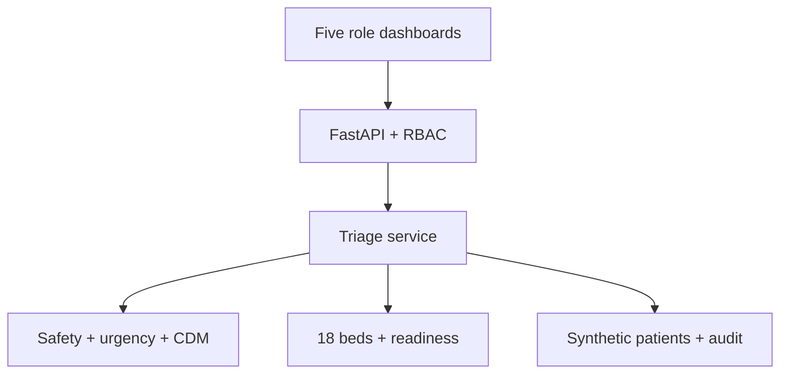

# PatientTriage.ai


> **The score does not move. The queue does.**

PatientTriage.ai is a branded, safety-first emergency-department coordination prototype for synthetic scenarios. It combines explicit safety floors, a transparent urgency model, a feature-conditioned Context-Dependent Model (CDM), uncertainty, continuous waiting-room monitoring, an 18-bed operational projection, role-based dashboards, clinician override, and a tamper-evident audit chain.


## What is new in version 0.3.0

- Supplied PatientTriage.ai logo and a navy/blue/cyan/teal visual system.
- Configurable district-hospital profile with 18 ED spaces, zones, shift start/end, staffing, catchment, normal load, and 3x surge.
- Five dashboards: nurse, doctor, pharmacy, administration, and blood bank.
- Explicit read/write permissions enforced by the API.
- Bed-wise and patient-wise navigation, colored by availability and acuity.
- Minimum-necessary pharmacy and blood-readiness acknowledgement views.
- Six reproducible queue-policy baselines: FCFS, acuity priority, SJF-like, waiting priority, acuity + wait, and PatientTriage.ai.
- Local scalability benchmark at 20, 60, and 180 waiting patients.
- Blockchain/consensus decision record with a no-blockchain MVP recommendation.
- US/UK/EU regulatory planning map.
- Low-level design, business proposal, SWOT, techno-economics, pitch deck, PDF report, and prototype video.
- Expanded software verification with **159 passing tests and 96.19% coverage** at the implementation checkpoint.

## Why the product is hackathon-worthy

Static triage assigns a category once. PatientTriage.ai demonstrates a living operational queue:

1. A patient arrives and is validated.
2. Red-flag rules establish an acuity floor.
3. Patient-level urgency and CDM context determine order inside the safe group.
4. Confidence, missing information, wait, and deterioration remain visible.
5. A new observation, arrival, surge, or override recomputes the queue.
6. Nurses and doctors switch between the 18-bed and patient views.
7. Pharmacy and blood-bank users see only necessary readiness signals.
8. Administration sees de-identified capacity and evaluation evidence.
9. Model failure produces a marked rule-only fallback instead of a silent stale answer.

## Phase 1 to Phase 2

| Area | Phase 1 | Version 0.3.0 |
|---|---|---|
| Relative model | Bradley-Terry-Luce concept | Feature-conditioned CDM; BTL removed |
| Safety | Proposed constraints | Executable floors that context cannot downgrade |
| Queue | Static prioritization | Dynamic re-ranking and monitoring |
| Capacity | Not represented | Configurable 18-bed ED projection |
| Users | Clinician concept | Five API-enforced role views |
| Evidence | Algorithm narrative | Six baselines, scale benchmark, tests, PDF/deck/video |
| Accountability | Proposed override | Mandatory reason and hash-chained audit |

## Architecture



The ranking order in the app is lexicographic:

1. Final acuity after hard safety floors.
2. CDM utility within the same acuity.
3. Arrival time.
4. Synthetic patient ID as deterministic tie-break.

This prevents a high CDM score from pushing a lower-acuity patient ahead of a safety-escalated critical patient.

## Context-Dependent Model

For patient feature vector \(x_i\) and current waiting set \(S\):

\[
U_i(S)=\beta^T x_i+\frac{1}{|S|-1}\sum_{j\in S, j\ne i}x_i^T W x_j
\]

The seven bounded features are physiology risk, symptom risk, pain, waiting time, deterioration, uncertainty, and age-group vulnerability. Every queue row exposes base utility, context effect, final utility, contextual probability, confidence, reasons, missing information, monitoring state, and action.

For a one-patient queue, context is zero and probability is one. For an empty queue, the model returns a valid empty result. Softmax is stabilized by subtracting the maximum utility.

See [CDM model](docs/CDM_MODEL.md).

## District-hospital simulation

All numbers are illustrative and configurable in `configs/district_hospital.json`.

| Parameter | Value |
|---|---:|
| Hospital | District General Hospital - Emergency Department |
| Catchment | 500,000 |
| Hospital beds | 200 |
| ED care spaces | 18 |
| Zones | 3 resuscitation, 9 acute, 6 observation |
| Treatment teams | 4 |
| Shift | 08:00-20:00 |
| Normal arrivals | 20 |
| Surge arrivals | 60 |
| Clinical shift staff | 3 physicians, 4 residents, 2 triage nurses, 12 staff nurses |

Replace every value with locally approved data before a shadow pilot. See [hospital profile](docs/HOSPITAL_PROFILE.md).

## Role dashboards

| Role | Main view | Write actions |
|---|---|---|
| Nurse | Bed-wise, patient-wise, live queue | Intake, vitals/reassessment, bed workflow permission |
| Doctor | Queue, beds, patient, override, readiness, audit | Intake, vitals, override, disposition |
| Pharmacy | Minimum-necessary medication readiness | Acknowledge readiness |
| Administration | Infrastructure, occupancy, baselines, audit | Normal/3x scenario control |
| Blood bank | Minimum-necessary transfusion readiness | Acknowledge readiness |

The role header is a demo mechanism, not production authentication. See [RBAC and dashboards](docs/RBAC_AND_DASHBOARDS.md).

## 18-bed UI

- Green: available.
- Red: critical.
- Orange: emergent.
- Amber: urgent.
- Blue: less urgent.
- Slate: non-urgent.

Color is not the only cue: each space displays its bed ID and the detail panel provides textual state. Select a bed to see the synthetic patient, queue position, wait, acuity, and monitoring state. Switch to the patient-wise view for explanations and missing data.

## Quick start with a virtual environment

Python 3.12 is recommended; 3.11-3.14 is supported.

### macOS/Linux

```bash
unzip patient-triage-ai-cdm-complete.zip
cd patient-triage-ai-cdm
python3 -m venv .venv
source .venv/bin/activate
python -m pip install --upgrade pip
python -m pip install -e ".[dev]"
python -m pytest
```

Or:

```bash
chmod +x scripts/*.sh
./scripts/setup_venv.sh
```

### Windows PowerShell

```powershell
Expand-Archive patient-triage-ai-cdm-complete.zip
cd patient-triage-ai-cdm
py -3.12 -m venv .venv
.venv\Scripts\Activate.ps1
python -m pip install --upgrade pip
python -m pip install -e ".[dev]"
python -m pytest
```

## Run locally

Terminal 1:

```bash
python -m uvicorn patient_triage.api.app:app --reload --port 8000
```

Terminal 2:

```bash
python -m streamlit run dashboard/streamlit_app.py
```

Open:

- Dashboard: http://localhost:8501
- API docs: http://localhost:8000/docs
- Health: http://localhost:8000/health

## Docker

```bash
docker compose up --build
```

The API is exposed at port 8000 and Streamlit at 8501. The image includes source, dashboard, brand asset, hospital/RBAC configuration, synthetic fixtures, and generated reports.

## Demo sequence

1. Choose **Triage nurse** and show the 18-bed board.
2. Switch to patient-wise detail and open the ambiguous zero-history case.
3. Simulate deterioration and show the queue update.
4. Choose **Emergency doctor**, apply an override, and show the audit event.
5. Show pharmacy and blood readiness without full-record access.
6. Choose **Hospital administration** and load the 3x surge.
7. Compare all six policies and explain throughput/safety trade-offs.
8. Simulate CDM failure and show stale/manual-review fallback.

The scriptable backend story remains available:

```bash
patient-triage-demo --output demo/sample_run.json
patient-triage-reports --output reports
```

## API and permissions

Use `X-Demo-Role` with one of `nurse`, `doctor`, `pharmacy`, `administration`, or `blood_bank`.

| Method | Endpoint | Purpose |
|---|---|---|
| GET | `/health` | Liveness/model version |
| GET | `/v1/access` | Demo policy matrix |
| GET | `/v1/infrastructure` | Configured district profile |
| GET/POST | `/v1/patients` | List or intake synthetic records |
| PUT | `/v1/patients/{id}/vitals` | Record new observation |
| PATCH | `/v1/patients/{id}/status` | Doctor disposition |
| GET | `/v1/queue` | Current dynamic queue |
| POST | `/v1/queue/overrides` | Doctor override with reason |
| GET | `/v1/beds` | 18-bed operational projection |
| GET | `/v1/evaluation/baselines` | Six-policy report |
| GET/POST | `/v1/coordination/{domain}` | Read/acknowledge readiness |
| POST | `/v1/simulations/{normal|surge}` | Admin scenario control |
| POST | `/v1/simulations/deteriorate/{id}` | Nurse/doctor synthetic update |
| GET | `/v1/audit` and `/verify` | Doctor/admin audit view |

Example:

```bash
curl -s http://localhost:8000/v1/beds \
  -H "X-Demo-Role: nurse" | python -m json.tool

curl -s http://localhost:8000/v1/evaluation/baselines \
  -H "X-Demo-Role: administration" | python -m json.tool
```

## Baseline evidence

The same synthetic workload is evaluated against:

- FIFO/FCFS;
- acuity priority;
- SJF-like;
- waiting-time priority;
- acuity + waiting;
- PatientTriage.ai.

The report does not rig a universal win. PatientTriage.ai ties acuity priority on the static safety-weighted metric in the supplied scenarios, while adding dynamic monitoring, uncertainty, fail-safe behavior, permissions, explanation, and override governance. SJF-like improves short-horizon throughput while worsening critical delay. See [benchmark report](docs/BENCHMARK_REPORT.md) and `reports/baseline_benchmark.csv`.

## Scalability evidence

The local microbenchmark performs 12 measured repetitions after warm-up:

| Patients | Mean | P95 |
|---:|---:|---:|
| 20 | 0.711 ms | 1.036 ms |
| 60 | 1.580 ms | 1.803 ms |
| 180 | 4.745 ms | 5.394 ms |

It isolates ranking and is not a production SLO. See [scalability and cost](docs/SCALABILITY_AND_COST.md) and `reports/scalability_benchmark.csv`.

## Failure behavior

If CDM scoring is unavailable or invalid:

1. Current patients still pass through validation, safety rules, and urgency scoring.
2. Safety/acuity order remains enforced.
3. Last-known-good position is used only as a within-acuity tie-break where possible.
4. New arrivals remain present.
5. Every affected row is stale and low confidence.
6. Manual reassessment warnings are shown.

## Blockchain decision

No blockchain is used in the MVP. The existing hash chain is appropriate for a single-hospital prototype. A permissioned consortium ledger should be considered only when independent institutions must share audit anchors. Hyperledger Fabric Raft is a crash-fault-tolerant option for trusted consortium members; SmartBFT is relevant when Byzantine behavior is in scope, with more overhead. Never place PHI on-chain. See [blockchain decision](docs/BLOCKCHAIN_DECISION.md).

## Regulation and clinical governance

The repository includes a planning map for:

- US HIPAA security and FDA clinical decision support guidance;
- UK GDPR special-category health data, MHRA SaMD guidance, NHS DCB0129/DCB0160, and DSPT;
- EU MDR/MDCG software qualification and the EU AI Act framework.

This does not determine classification or establish compliance. See [regulatory mapping](docs/REGULATORY_MAPPING.md).

## Costs and business

Illustrative monthly cloud ranges run from $180-$650 for a small single-hospital shadow environment and $900-$2,800 for a production high-availability planning case. A 12-week one-site pilot delivery range is INR 28-62 lakh. These are order-of-magnitude assumptions, not a quote or ROI claim, and exclude EHR fees, legal advice, taxes, devices, and 24x7 staffing.

- [Business proposal](docs/BUSINESS_PROPOSAL.md)
- [SWOT](docs/SWOT.md)
- [Scalability and techno-economics](docs/SCALABILITY_AND_COST.md)
- [Implementation roadmap](docs/IMPLEMENTATION_ROADMAP.md)

## Tests and edge cases

```bash
PYTHONWARNINGS="error::DeprecationWarning" python -m pytest
python -m ruff format --check .
python -m ruff check .
python -m pip check
```

Coverage includes empty/single/tied queues, numerical stability, hard safety floors, pediatric/geriatric ranges, zero history, missing and stale observations, invalid/future/out-of-order timestamps, deterioration, normal/surge/failure modes, override safety conflicts, hash tampering, role denial paths, malformed hospital configuration, empty/normal/surge bed boards, readiness acknowledgements, all six policies, scalability validation, and API error contracts.

## Dependency policy

Direct dependencies are exactly pinned for reproducibility and the package uses current APIs. Deprecation warnings from project code are treated as errors.

| Package | Version |
|---|---:|
| FastAPI | 0.141.1 |
| Uvicorn | 0.52.4 |
| Pydantic | 2.13.4 |
| NumPy | 2.5.2 |
| pandas | 3.0.5 |
| Plotly | 6.9.0 |
| Streamlit | 1.62.0 |
| HTTPX2 | 2.12.0 |
| pytest | 9.1.1 |
| pytest-cov | 7.1.0 |
| Ruff | 0.16.4 |

Current interfaces include FastAPI lifespan, Pydantic v2 methods, timezone-aware UTC, Streamlit `width="stretch"`, and Docker Compose without an obsolete top-level version key.

## Repository map

```text
patient-triage-ai-cdm/
├── assets/branding/            # supplied logo
├── configs/                    # hospital, RBAC, and cost assumptions
├── dashboard/                  # five role views and charts
├── data/synthetic/             # 20/60 patient fixtures
├── docs/                       # LLD, safety, business, regulation, SWOT, cost
├── reports/                    # reproducible baseline/scale CSV and JSON
├── src/patient_triage/         # domain, rules, models, services, API, storage
├── tests/                      # unit, integration, API, safety, edge cases
├── Dockerfile
├── docker-compose.yml
├── pyproject.toml
├── requirements.txt
└── requirements-dev.txt
```

## Detailed documentation

- [System design](docs/SYSTEM_DESIGN.md)
- [Low-level design](docs/LOW_LEVEL_DESIGN.md)
- [Safety model](docs/SAFETY_MODEL.md)
- [CDM model](docs/CDM_MODEL.md)
- [Data dictionary](docs/DATA_DICTIONARY.md)
- [RBAC and dashboards](docs/RBAC_AND_DASHBOARDS.md)
- [Hospital profile](docs/HOSPITAL_PROFILE.md)
- [Benchmark report](docs/BENCHMARK_REPORT.md)
- [Scalability and cost](docs/SCALABILITY_AND_COST.md)
- [Blockchain decision](docs/BLOCKCHAIN_DECISION.md)
- [Regulatory mapping](docs/REGULATORY_MAPPING.md)
- [Business proposal](docs/BUSINESS_PROPOSAL.md)
- [SWOT](docs/SWOT.md)
- [Implementation roadmap](docs/IMPLEMENTATION_ROADMAP.md)
- [Demo script](docs/DEMO_SCRIPT.md)
- [Prototype video script](docs/PROTOTYPE_VIDEO_SCRIPT.md)
- [Test matrix](docs/TEST_MATRIX.md)
- [Test report](docs/TEST_REPORT.md)

## Limitations

- Thresholds and coefficients are illustrative, not clinically learned or approved.
- Synthetic labels are not clinical ground truth.
- Confidence is a data-quality heuristic, not a calibrated outcome probability.
- The patient store, acknowledgement state, and demo identity mechanism are process-local.
- The hash chain is tamper-evident, not tamper-proof.
- No live device, EHR, lab, pharmacy, blood-bank, or ADT integration is included.
- Passing software tests does not establish clinical safety, efficacy, fairness, or regulatory compliance.


