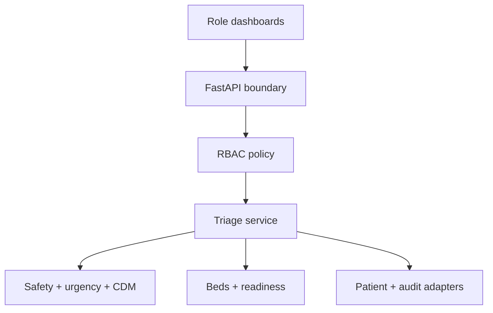

# Low-level design

## 1. Scope and invariants

PatientTriage.ai is an emergency queue and readiness-coordination prototype. It must satisfy these invariants:

1. A hard safety floor is evaluated before contextual ranking.
2. Context can order patients only inside the final acuity group; it cannot downgrade a safety escalation.
3. Missing or stale data is displayed and reduces confidence.
4. Model failure returns a visible, rule-based current-patient fallback.
5. A clinician can override the recommendation; the reason is mandatory and audited.
6. Pharmacy and blood-bank screens receive minimum-necessary readiness signals only.
7. The 18-bed screen is a projection, never the hospital bed source of truth.
8. All included records are synthetic and contain no names, addresses, phone numbers, or government identifiers.

## 2. Component topology

| Package | Classes/functions | Responsibility |
|---|---|---|
| `domain.patient` | `Patient`, `VitalSigns` | Validate ranges, identifiers, timezones, and timelines |
| `domain.hospital` | `HospitalProfile`, `AccessControlMatrix` | Parse configurable site assumptions and permissions |
| `domain.operations` | `BedBoard`, `BedSlot`, `CoordinationTask` | Immutable operational API contracts |
| `rules.safety_rules` | explicit rule functions | Compute non-negotiable safety floors and reasons |
| `models.features` | feature extraction | Create seven bounded, explainable features |
| `models.urgency` | transparent scoring | Map patient-only features to five-level acuity |
| `models.cdm` | context-dependent utility | Add patient-to-waiting-set interactions |
| `models.confidence` | data-quality heuristic | Score completeness, history, freshness, and ambiguity |
| `services.monitoring` | monitoring state | Detect deterioration, staleness, and reassessment due |
| `services.ranking` | `RankingService` | Fuse safety, acuity, CDM, confidence, and deterministic ties |
| `services.bed_board` | `build_bed_board` | Project waiting patients onto 18 configured spaces |
| `services.coordination` | `CoordinationService` | Derive and acknowledge pharmacy/blood readiness signals |
| `services.access_control` | `AccessController` | Enforce permission checks at each API use case |
| `services.triage` | `TriageService` | Application orchestration and audit events |
| `evaluation.baselines` | `compare_baselines` | Simulate six non-preemptive queue policies |
| `evaluation.scalability` | `benchmark_scalability` | Repeat local rank latency at selected queue sizes |
| `storage.sqlite_audit` | `SQLiteAuditStore` | Append and verify hash-chained events |

## 3. Ranking sequence

For every waiting patient:

1. Validate the model and observation timestamps.
2. Evaluate red-flag rules and create a safety floor.
3. Extract physiology, symptom, pain, waiting, deterioration, uncertainty, and age-vulnerability features.
4. Calculate transparent urgency and convert it to acuity.
5. Choose the more urgent of the safety floor and urgency acuity.
6. Calculate CDM base utility, context effect, final utility, and contextual probability.
7. Evaluate monitoring state and confidence.
8. Sort lexicographically by final acuity, descending CDM utility, arrival time, and ID.
9. Reapply valid clinician overrides and record safety-conflict warnings.

The CDM utility for patient feature vector `x_i` and waiting set `S` is:

\[
U_i(S)=\beta^T x_i+\frac{1}{|S|-1}\sum_{j\ne i}x_i^T W x_j
\]

For a one-patient queue, the context term is zero. The softmax subtracts the maximum utility before exponentiation.

## 4. Bed projection algorithm

The configured zone list is expanded into 18 stable slot labels (`ED-01` to `ED-18`). Waiting entries are sorted by synthetic patient ID before assignment so re-ranking does not visually move every occupied patient between beds. Patients beyond capacity remain in `waiting_patients`, sorted by current queue position.

This is intentionally not admission or transfer logic. Production integration would subscribe to the hospital's authoritative bed events and map its immutable bed identifiers.

## 5. Readiness-task derivation

### Pharmacy

A task is created for emergent/critical acuity, high recorded pain, or absent prior record. It communicates review readiness, not a medication order.

### Blood bank

A task is created for severe bleeding, recorded systolic pressure below the illustrative shock threshold, or critical trauma. It communicates transfusion-readiness review, not blood ordering or cross-match completion.

Acknowledgements are thread-safe in memory and are written to the audit chain. Loading a new scenario clears them.

## 6. API contracts and RBAC

| Endpoint | Permission |
|---|---|
| `GET /v1/infrastructure` | `facility.read` |
| `GET /v1/patients` | `patient.read` |
| `POST /v1/patients` | `intake.write` |
| `PUT /v1/patients/{id}/vitals` | `vitals.write` |
| `PATCH /v1/patients/{id}/status` | `disposition.write` |
| `GET /v1/queue` | `queue.read` |
| `POST /v1/queue/overrides` | `override.write` |
| `GET /v1/beds` | `bed.read` |
| `GET /v1/evaluation/baselines` | `analytics.read` |
| `GET /v1/coordination/pharmacy` | `pharmacy.read` |
| `POST /v1/coordination/pharmacy/{task}/acknowledge` | `pharmacy.acknowledge` |
| `GET /v1/coordination/blood_bank` | `blood_bank.read` |
| `POST /v1/coordination/blood_bank/{task}/acknowledge` | `blood_bank.acknowledge` |
| `GET /v1/audit*` | `audit.read` |
| `POST /v1/simulations/{scenario}` | `scenario.write` |

Domain errors map to stable HTTP behavior: 400 invalid sequence/override, 403 denied role, 404 unknown patient/task, 409 duplicate patient, and 422 schema/header validation.

## 7. State and concurrency

- `InMemoryPatientRepository` protects mutations with `RLock` and returns validated copies.
- `TriageService` protects overrides and the last-known-good snapshot with `RLock`.
- `CoordinationService` protects acknowledgement state with `RLock`.
- `SQLiteAuditStore` serializes append operations and links each event hash to the previous hash.

The service is process-local in the hackathon package. Horizontal replicas therefore require external patient, override, acknowledgement, and audit stores.

## 8. Configuration

| File/environment | Purpose |
|---|---|
| `configs/district_hospital.json` | Capacity, zones, staffing, shift, and model-component inventory |
| `configs/rbac.json` | Role display names and read/write permissions |
| `configs/cost_assumptions.json` | Dated planning ranges and conversion assumption |
| `PATIENT_TRIAGE_DATABASE_PATH` | Audit database path |
| `PATIENT_TRIAGE_HOSPITAL_PROFILE_PATH` | Alternate site profile |
| `PATIENT_TRIAGE_RBAC_PATH` | Alternate policy file |
| `PATIENT_TRIAGE_NORMAL_CAPACITY` | Queue pressure denominator |
| `PATIENT_TRIAGE_SURGE_MULTIPLIER` | Surge threshold multiplier |
| `PATIENT_TRIAGE_MODEL_VERSION` | Version recorded with audit events |

## 9. Production adapter interfaces

Replace prototype adapters behind the service boundary:

- patient repository -> governed FHIR/EHR/event adapter;
- demo role header -> OIDC claims mapped to site roles;
- SQLite -> managed append-only database and centralized immutable log;
- in-memory acknowledgements -> transactional workflow store;
- local config -> signed, versioned configuration service;
- Streamlit demo -> accessibility-tested clinical application.

Each inbound event needs an idempotency key, source timestamp, ingestion timestamp, site ID, schema version, and provenance. Out-of-order or duplicate observations must not silently replace newer data.

## 10. Observability and failure controls

Minimum production telemetry:

- rank latency and queue size;
- observation-event lag and staleness;
- fallback count and duration;
- critical/high-risk queue position;
- alerts and acknowledgements;
- override count, reason category, and safety conflicts;
- denied authorization attempts;
- audit-write failures;
- database, identity, and integration health;
- configuration/model version by decision.

Downtime behavior must show the last known timestamp, mark all affected recommendations stale, continue explicit red-flag/manual workflows, and provide a tested return-to-service procedure.

## 11. Verification strategy

Unit tests cover validation and deterministic algorithms. Integration tests cover services and audit behavior. API tests cover schemas, errors, and role denial paths. Scenario tests cover 20 patients, 60-patient surge, pediatric/geriatric/zero-history/ambiguous records, deterioration, fallback, and override. Report generation covers all six baselines and local scalability measurements.

Passing tests establish software behavior only; they do not establish clinical safety, effectiveness, fairness, or regulatory status.
