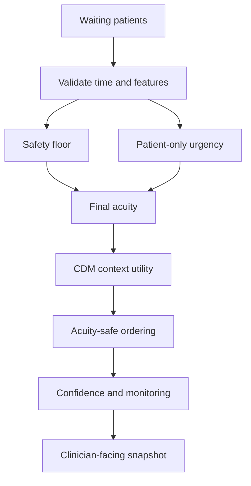

# System design

## Goal

PatientTriage.ai coordinates a changing synthetic waiting queue. It does not diagnose disease and does not replace a clinician. Its output is a reviewable recommendation containing position, acuity, confidence, evidence, missing information, monitoring state, and action.

## Design principles

1. Safety rules run before statistical ranking.
2. Missing information is visible and reduces confidence.
3. Under uncertainty, the prototype favours review or escalation.
4. Every recommendation can be overridden by a clinician.
5. Changes and overrides are auditable.
6. Model failure must remain visible and must not stop red-flag checks.
7. Synthetic evaluation labels are never model inputs.

## Runtime components

| Component | Responsibility |
|---|---|
| Pydantic domain models | Validate patient identifiers, ages, observations, ranges, and timelines |
| In-memory repository | Hold the current synthetic waiting set |
| Safety rules | Produce a hard acuity floor and explicit rule identifiers |
| Feature extractor | Produce seven bounded features and explanations |
| Urgency model | Convert patient-only features into a transparent score and acuity |
| CDM | Add waiting-set interactions and contextual choice probability |
| Ranking service | Enforce acuity first, then contextual utility and deterministic ties |
| Monitoring service | Detect deterioration, staleness, and overdue reassessment |
| Confidence model | Score data completeness, ambiguity, history, freshness, and availability |
| Triage service | Coordinate intake, updates, ranking, simulation, and overrides |
| SQLite audit store | Append hash-chained system and clinician events |
| FastAPI | Expose validated application use cases |
| Streamlit | Present the demo queue and controls |

## Queue computation

The queue is recomputed after a patient arrives, vital signs change, status changes, a scenario is loaded, or a client asks for the latest ranking. Overrides are reapplied and remain visible until the patient leaves the waiting set or a new scenario replaces the queue.

## Failure path

When CDM scoring is deliberately disabled or rejects invalid/non-finite features:

1. The current patient set is still validated.
2. Safety floors and patient-level acuity are recomputed.
3. Ordering uses acuity, the last-known-good position when present, arrival time, and identifier.
4. New arrivals remain in the queue.
5. Every entry is marked stale and requires manual review.
6. Critical and deterioration alerts retain their higher-priority action.

## State and persistence

Patient records are kept in memory because this is a demo. Audit events are persisted to SQLite. The database contains no names or real patient identifiers. A production design would replace both adapters without changing the domain and service interfaces.

## Scalability path

For a real engineering continuation:

- replace the in-memory repository with an authenticated clinical-data adapter;
- replace SQLite with managed append-only audit storage;
- separate queue updates into idempotent events;
- publish observation changes to a durable event stream;
- make ranking stateless and version all parameters;
- add hospital-specific configuration with clinical governance approval;
- add authentication, authorization, encryption, retention, observability, and incident response; and
- validate latency and failure behavior under realistic load.

These steps would still not make the system clinically deployable without independent clinical and regulatory work.
